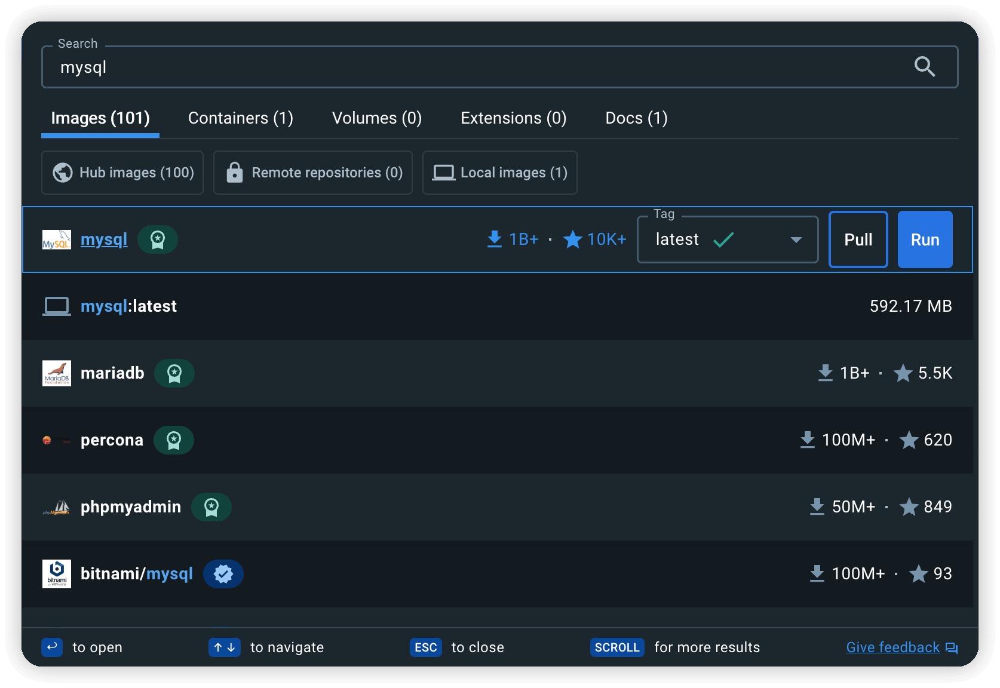
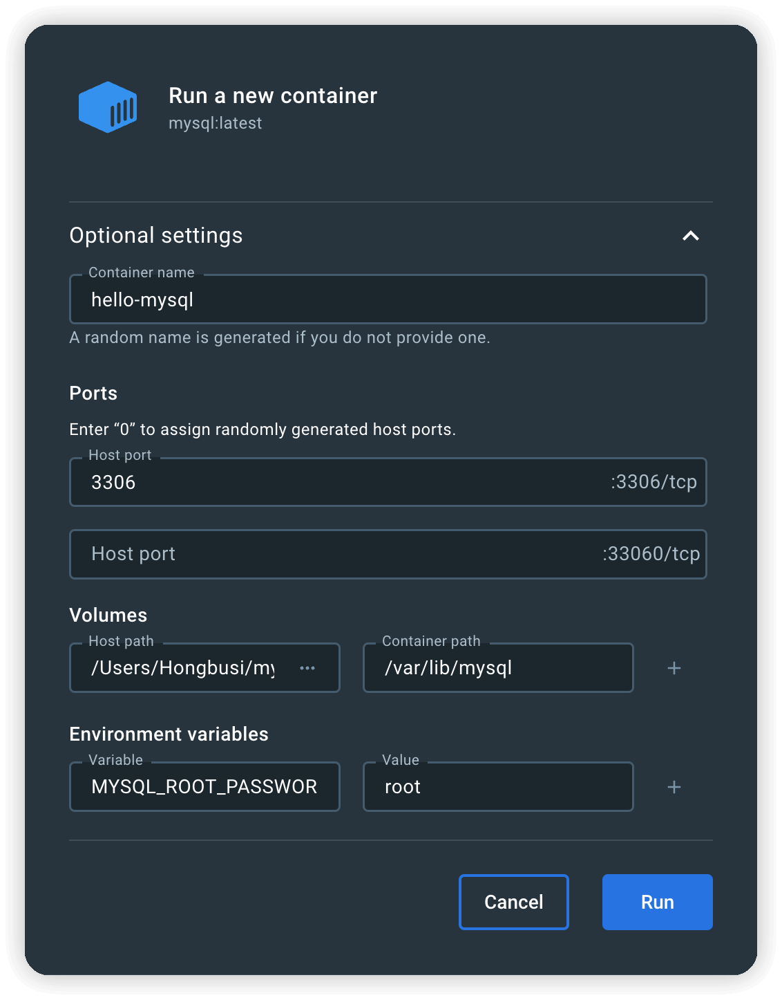
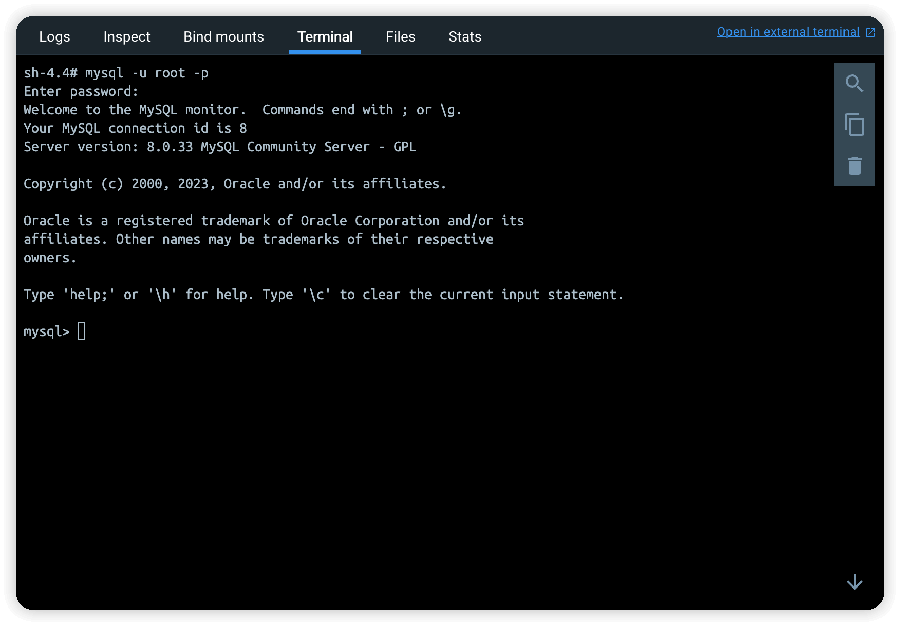

## 使用 Docker 创建 MySQL 容器

通过 Docker Desktop 查询 MySQL 镜像：



点击 Run，传入参数：

- 3306 端口：client 连接 mysql 的端口。
- 33060 端口：mysql8 新增的管理 mysql server 的端口。（这里用不到）
- Volumes：用本地目录作为数据卷挂载到容器的 `/var/lib/mysql` 目录，这个是 mysql 保存数据的目录。
- Environment variables：指定连接 mysql server 的密码 `MYSQL_ROOT_PASSWORD`。

::: tip 不设置 `MYSQL_ROOT_PASSWORD`，容器跑起来会有这样的提示

``` bash
# 您需要指定以下之一作为环境变量：
You need to specify one of the folLowing as an environment variable：
- MYSQL ROOT_ PASSHORD
- MYSQL ALLOW_ EMPTY_PASSWORD
- MYSQL RANDOM ROOT PASSWORD
```
:::



点击 Run，mysql 容器就可以成功跑起来了。

## MySQL 镜像自带的命令行工具

输入 `mysql -u root -p` 然后输入密码，就进入 mysql 操作界面了。



## MySQL 客户端推荐

- [MySQL Workbench](https://dev.mysql.com/downloads/workbench) - 官方 GUI 客户端。
- [Navicat Premium](https://www.navicat.com/en/products/navicat-premium) - 好用但付费。
