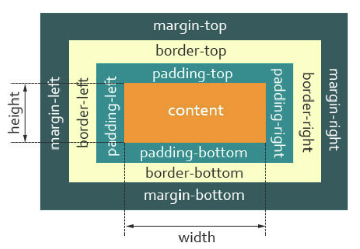

[[toc]]

## 一、盒模型是什么

当对一个文档进行布局（layout）的时候，浏览器的渲染引擎会根据标准之一的 CSS 基础框盒模型（CSS basic box model），将所有元素表示为一个个矩形的盒子（box）。

一个盒子由四个部分组成：`content`、`padding`、`border`、`margin`。



- `content`，实际内容，显示文本和图像；
- `padding`，内边距，内容与其边框之间的空间。内边距是透明的，取值不能为负；
- `border`，边框，围绕元素内容的内边距的一条或多条线，由粗细、样式、颜色三部分组成；
- `margin`，外边距，在元素外创建额外的空白，空白通常指不能放其他元素的区域。

下面来段代码：

``` html
<style>
  .box {
    padding: 20px;
    width: 200px;
    height: 100px;
  }
</style>
<div class="box">
  盒子模型
</div>
```

当我们在浏览器查看元素时，却发现元素的大小变成了 `240px`。

这是因为，在 CSS 中，盒子模型可以分成：

- W3C 标准盒子模型；
- IE 怪异盒子模型。

默认情况下，盒子模型为 W3C 标准盒子模型。

## 二、标准盒子模型

标准盒子模型，是浏览器默认的盒子模型。


从上图可以看到：

- 盒子总宽度 = `width` + `padding` + `border` + `margin`；
- 盒子总高度 = `height` + `padding` + `border` + `margin`。

也就是，`width`/`height` 只是内容高度，不包含 `padding` 和 `border` 值。

所以上面问题中，设置 `width` 为 `200px`，但由于存在 `padding`，但实际上盒子的宽度有 `240px`。

## 三、IE 怪异盒子模型


从上图可以看到：

- 盒子总宽度 = `width` + `margin`；
- 盒子总高度 = `height` + `margin`。

也就是，`width`/`height` 包含了 `padding` 和 `border` 值。

## 四、box-sizing

CSS 中的 `box-sizing` 属性定义了引擎应该如何计算一个元素的总宽度和总高度。

``` css
box-sizing: content-box | border-box | inherit;
```

- `content-box` 是默认值，元素的 `width`/`height` 不包含 `padding`，`border`，与标准盒子模型表现一致；
- `border-box` 元素的 `width`/`height` 包含 `padding`，`border`，与怪异盒子模型表现一致；
- `inherit` 指定 `box-sizing` 属性的值，应该从父元素继承。

回到上面的例子里，设置盒子为 `border-box` 模型：

``` html
<style>
  .box {
    padding: 20px;
    width: 200px;
    height: 100px;
    box-sizing: border-box;
  }
</style>
<div class="box">
  盒子模型
</div>
```

这时候，就可以发现盒子的所占据的宽度为 `200px`。

## 参考文献

- https://developer.mozilla.org/zh-CN/docs/Learn/CSS/Building_blocks/The_box_model
- https://developer.mozilla.org/zh-CN/docs/Web/CSS/box-sizing
- https://vue3js.cn/interview/css/box.html
