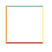
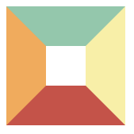
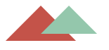
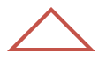

[[toc]]

## 一、前言

在前端开发的时候，我们有时候会需要用到一个三角形的形状，比如地址选择或者播放器里面播放按钮。

通常情况下，我们会使用图片或者 `svg` 去完成三角形效果图，但如果单纯使用 `css` 如何完成一个三角形呢？

实现过程似乎也并不困难，通过边框就可完成。

## 二、实现过程

在以前也讲过盒子模型，默认情况下是一个矩形，实现也很简单：

``` html
<style>
  .border {
    width: 50px;
    height: 50px;
    border: 2px solid;
    border-color: #96ceb4 #ffeead #d9534f #ffad60;
  }
</style>
<div class="border"></div>
```

效果如下图所示：



将 `border` 设置 `50px`，效果图如下所示：



白色区域则为 `width`、`height`，这时候只需要你将白色区域部分宽高逐渐变小，最终变为 0，则变成如下图所示：


这时候就已经能够看到 4 个不同颜色的三角形，如果需要下方三角形，只需要将上、左、右边框设置为 0 就可以得到下方的红色三角形。

但这种方式，虽然视觉上是实现了三角形，但实际上，隐藏的部分任然占据部分高度，需要将上方的宽度去掉。

最终实现代码如下：

``` html
<style>
  .border {
    width: 0;
    height: 0;
    border-style:solid;
    border-width: 0 50px 50px;
    border-color: transparent transparent #d9534f;
  }
</style>
<div class="border"></div>
```


如果想要实现一个只有边框是空心的三角形，由于这里不能再使用 `border` 属性，所以最直接的方法是利用伪类新建一个小一点的三角形定位上去。

``` html
<style>
  .border {
    position: relative;
    width: 0;
    height: 0;
    border-style: solid;
    border-width: 0 50px 50px;
    border-color: transparent transparent #d9534f;
  }

  .border:after{
    content: '';
    position: absolute;
    top: 0;
    left: 0;
    border-style: solid;
    border-width: 0 40px 40px;
    border-color: transparent transparent #96ceb4;
  }
</style>
<div class="border"></div>
```

效果图如下所示：



伪类元素定位参照对象的内容区域宽高都为 0，则内容区域即可以理解成中心一点，所以伪元素相对中心这点定位。

将元素定位进行微调以及改变颜色，就能够完成下方效果图：



最终代码如下：

``` html
<style>
  .border {
    position: relative;
    width: 0;
    height: 0;
    border-style: solid;
    border-width: 0 50px 50px;
    border-color: transparent transparent #d9534f;
  }

  .border:after{
    content: '';
    position: absolute;
    top: 6px;
    left: -40px;
    border-style: solid;
    border-width: 0 40px 40px;
    border-color: transparent transparent white;
  }
</style>
<div class="border"></div>
```

## 三、原理分析

边框是实现三角形的核心部分。边框实际上并不是一个直线，如果我们将四条边设置不同的颜色，将边框逐渐放大，可以得到每条边框都是一个梯形。三角形就是通过边框这一点特性实现。

## 参考文献

- https://vue3js.cn/interview/css/triangle.html
