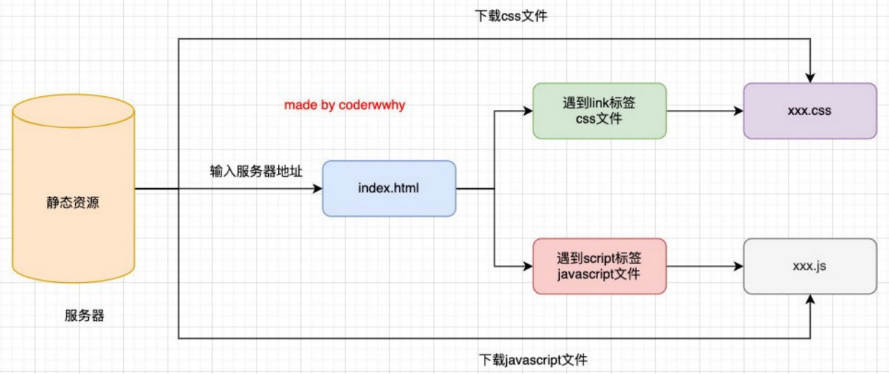
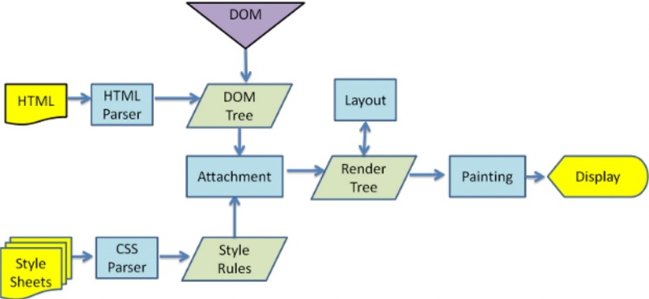

大家有没有深入思考过：JavaScript代码，在浏览器中是如何被执行的？

## 认识浏览器的内核

我们经常会说，不同的浏览器有不同的内核组成：

- **Gecko**：早期被 Netscape 和 Mozilla Firefox 浏览器浏览器使用；
- **Trident**：微软开发，被 IE4~IE11 浏览器使用，但是 Edge 浏览器已经转向 Blink；
- **Webkit**：苹果基于 KHTML 开发、开源的，用于 Safari，Google Chrome 之前也在使用；
- **Blink**：是 Webkit 的一个分支，Google 开发，目前应用于 Google Chrome、Edge 等；
- 等等...

事实上，我们经常说的浏览器内核指的是浏览器的排版引擎：**排版引擎**（layout engine），也称为**浏览器引擎**（browser engine）、**页面渲染引擎**（rendering engine） 或**样版引擎**。

## 浏览器渲染过程

### 但在这个执行过程中，HTML 解析的时候遇到了 JavaScript 标签，该怎么办呢？

会停止解析 HTML，而去加载和执行 JavaScript 代码。

### 那 JavaScript 代码由谁来执行呢？

JavaScript 引擎。

## 认识 JavaScript 引擎

### 为什么需要 JavaScript 引擎呢？

- 我们前面说过，**高级的编程语言**都是需要转成**最终的机器指令来执行**的；
- 我们编写的 JavaScript 无论你交给**浏览器或者 Node 执行**，最后都是需要被 **CPU** 执行的；
- 但是 CPU 只认识自己的指令集，实际上是机器语言，才能被 CPU 所执行；
- 所以我们需要 **JavaScript 引擎**帮助我们将 **JavaScript 代码**翻译成 **CPU 指令**来执行；

### 比较常见的 JavaScript 引擎有哪些呢？

- **SpiderMonkey**：第一款 JavaScript 引擎，由 Brendan Eich 开发（JavaScript 作者）；
- **Chakra**：微软开发，用于 IE 浏览器；
- **JavaScriptCore**：WebKit 中的 JavaScript 引擎，Apple 公司开发；
- **V8**：Google 开发的强大 JavaScript 引擎，也帮助 Chrome 从众多浏览器中脱颖而出；
- 等等…

## 浏览器内核和 JS 引擎的关系

这里我们先以 WebKit 为例，WebKit 事实上由两部分组成的：

- **WebCore**：负责 HTML 解析、布局、渲染等等相关的工作；
- **JavaScriptCore**：解析、执行 JavaScript 代码；

