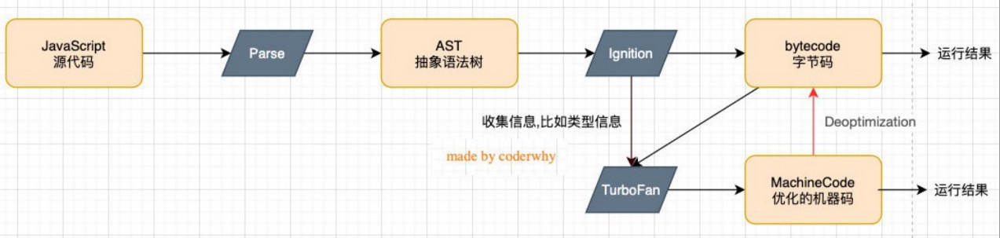
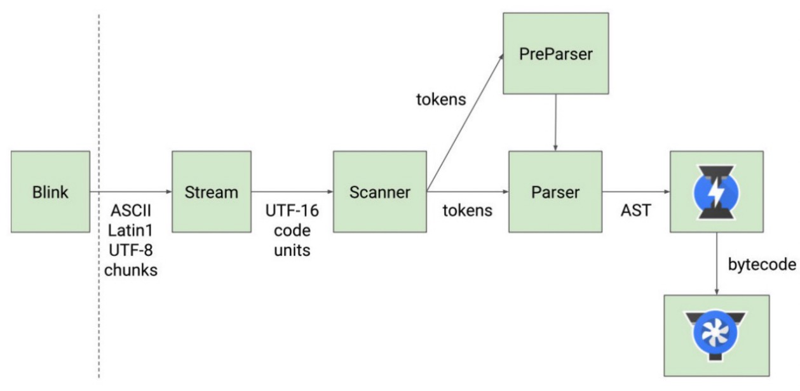

官方对 V8 引擎的定义：

- V8 是用 C++ 编写的 Google 开源高性能 JavaScript 和 WebAssembly 引擎，它用于 Chrome 和 Node.js 等；
- 它实现 ECMAScript 和 WebAssembly，并在 Windows7 或更高版本，macOS 10.12+ 和使用 x64，IA-32，ARM 或 MIPS 处理器的 Linux 系统上运行；
- V8 可以独立运行，也可以嵌入到任何 C++ 应用程序中；

## V8 引擎的架构

V8 引擎本身的源码非常复杂，大概有超过 100w 行 C++ 代码，通过了解它的架构，我们可以知道它是如何对 JavaScript 执行的：

- **Parse** 模块会将 JavaScript 代码转换成 AST（抽象语法树），这是因为解释器并不直接认识 JavaScript 代码；
  - 如果函数没有被调用，那么是不会被转换成 AST 的；
  - Parse 的 V8 官方文档：[https://v8.dev/blog/scanner](https://v8.dev/blog/scanner)
- **Ignition** 是一个解释器，会将 AST 转换成 ByteCode（字节码）；
  - 同时会收集 TurboFan 优化所需要的信息（比如函数参数的类型信息，有了类型才能进行真实的运算）；
  - 如果函数只调用一次，Ignition 会执行解释执行 ByteCode；
  - Ignition 的 V8 官方文档：[https://v8.dev/blog/ignition-interpreter](https://v8.dev/blog/ignition-interpreter)
- **TurboFan** 是一个编译器，可以将字节码编译为 CPU 可以直接执行的机器码；
  - 如果一个函数被多次调用，那么就会被标记为热点函数，那么就会经过 TurboFan 转换成优化的机器码，提高代码的执行性能；
  - 但是，机器码实际上也会被还原为 ByteCode，这是因为如果后续执行函数的过程中，类型发生了变化（比如 sum 函数原来执行的是 number 类型，后来执行变成了 string 类型），之前优化的机器码并不能正确的处理运算，就会逆向的转换成字节码；
  - TurboFan 的 V8 官方文档：[https://v8.dev/blog/turbofan-jit](https://v8.dev/blog/turbofan-jit)

## V8 引擎的解析图（官方）

## V8 执行的细节

那么我们的 JavaScript 源码是如何被解析（Parse 过程）的呢？

- Blink 将源码交给 V8 引擎，Stream 获取到源码并且进行编码转换；
- Scanner 会进行词法分析（lexical analysis），词法分析会将代码转换成 tokens；
- 接下来 tokens 会被转换成 AST 树，经过 Parser 和 PreParser：
  - Parser 就是直接将 tokens 转成 AST 树架构；
  - PreParser 称之为预解析，为什么需要预解析呢？
    - 这是因为并不是所有的 JavaScript 代码，在一开始时就会被执行。那么对所有的 JavaScript 代码进行解析，必然会影响网页的运行效率；
    - 所以 V8 引擎就实现了 Lazy Parsing（延迟解析）的方案，它的作用是将不必要的函数进行预解析，也就是只解析暂时需要的内容，而对函数的全量解析是在函数被调用时才会进行；
    - 比如我们在一个函数 outer 内部定义了另外一个函数 inner，那么 inner 函数就会进行预解析；
- 生成 AST 树后，会被 Ignition 转成字节码（bytecode），之后的过程就是代码的执行过程。
