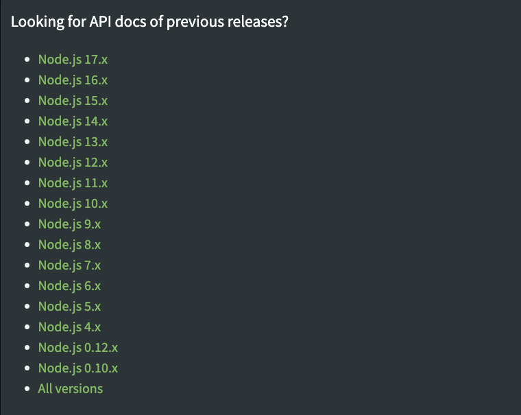

# Node.js 是什么？

[Node.js](https://nodejs.org) 官网是这样描述的：

> Node.js® is an open-source, cross-platform JavaScript runtime environment.

::: tip
Node.js 并不是语言，而是一个 JavaScript 运行时环境，它的语言是 JavaScript。
:::

## 2014～2015 年：Node.js 与 io.js

Node.js 社区其实在 2014 年底的时候经历过一波社区分裂。有一部分核心开发者从 Node.js v0.12 的源码 Fork 出来，发布 io.js。起因是当时的 GateKeeper 者 Isaac Z. Schlueter 卸任之后，Node.js 的发展（发版）变得缓慢，当时控制 Node.js 的公司 Joyent 又不作为，Node.js v1.0 遥遥无期；再加上本身社区处于一个急速上升期，这自然就引发社区的不满，于是开始自己搞。但又由于可能存在的商标问题，Fork 出来的项目就叫 io.js 了。

io.js 采用 CTC（核心技术委员会，Core Technical Committee）模式来运作，由他们来决定技术的方向、项目管理和流程、贡献的原则、管理附加的合作者等。并引入 Core Collaborators，代码仓库的维护不仅仅局限在几个核心贡献者手中。不过现在 Node.js 已经没有 CTC 了，而是转成了 TSC（技术指导委员会，Technical Steering Committee）。

io.js 在 2015 年初就马上发布了 v1.0 版本，后续 v2.0 版本也很快就跟上。彼时 Node.js 还在 v0.13、v0.14 徘徊。后来 Node.js 与 io.js 达成了和解，Joyent 公司做出了让步，并将 Node.js 迁移至基金会。后续 Node.js 和 io.js 在合并之前仍各自发展，直至最终融合。

下图是目前 Node.js 官方文档站里面列出的“版本们”，我们可以看到 Node.js v0.12.x 之后，缺失了 v1.x、v2.x 和 v3.x。这就是 Node.js 与 io.js 分裂时期，合并之后，Node.js 直接从 v0.12.x 版本跨越到了 v4.x。

