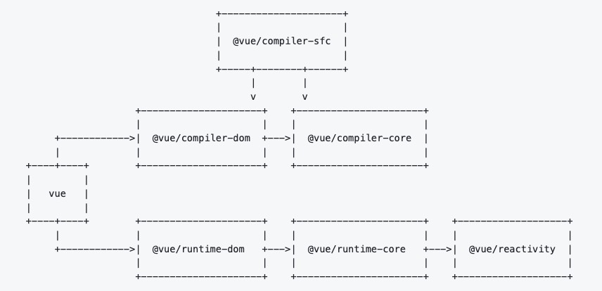

# Vue3 源码结构介绍

- `compiler-sfc`: 用于编译 Vue 单文件组件。

- `compiler-core`: 与平台无关的编译器核心。包括编译器的可扩展基础和所有与平台无关的插件。

- `compiler-dom`: 带有专门针对浏览器的附加插件的编译器。

- `reactivity`: 响应式系统。它可以作为与框架无关的包独立使用。

- `runtime-core`: 与平台无关的运行时核心。包括虚拟 dom 渲染器、组件实现和 JavaScript API 的代码。可以使用此包创建针对特定平台的高阶运行时（即自定义渲染器）。

- `runtime-dom`: 针对浏览器的运行时。包括处理原生 DOM API、属性、属性、事件处理程序等。

- `vue`: 面向公众的完整构建，包括运行时和编译器。
